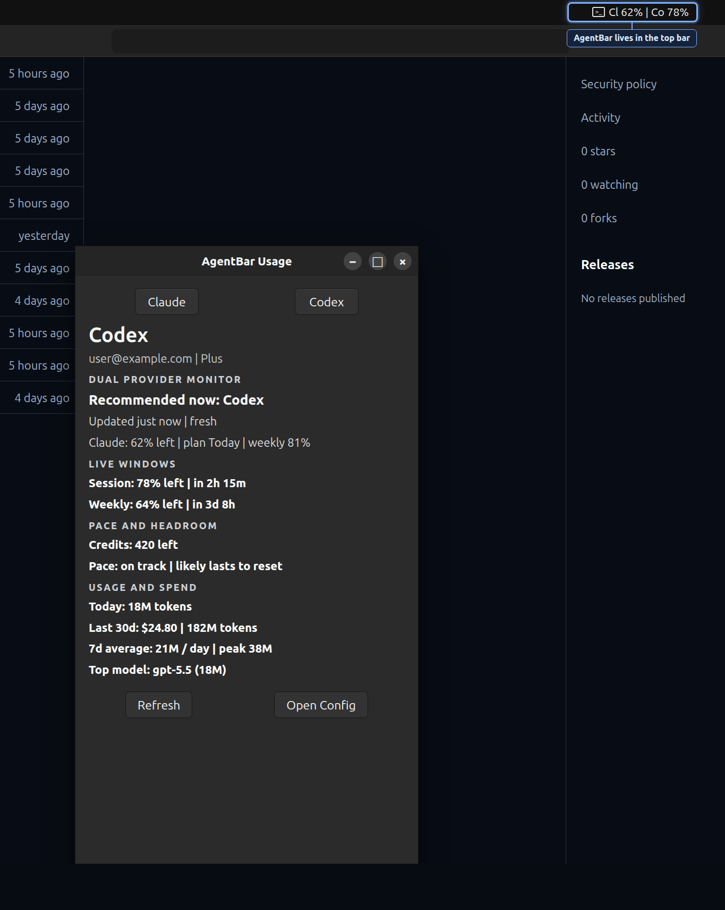

# AgentBar

AgentBar is a local-first Linux tray app and CLI for monitoring usage, reset windows, spend, and status across coding tools and AI services.

It reads local provider CLIs, known config files, browser cookies, and provider usage endpoints only for features you enable. AgentBar does not send usage data to an AgentBar backend.



## Features

- GNOME/AppIndicator tray label for active provider usage.
- GTK usage panel with provider tabs, reset windows, headroom, pace, and local spend history.
- Text and JSON CLI output for usage, config validation, and local cost scans.
- Local recommendations and notifications based on freshness, resets, pace, and headroom.
- Optional generated tray icons that show remaining-usage cues.
- Provider-aware local storage for account, plan, reset, and spend state.

## Supported Providers

AgentBar includes adapters for Codex, Claude, OpenCode, OpenCode Go, Gemini, Antigravity, Copilot, z.ai, MiniMax, Kimi, Kimi K2, Kilo Code, Kiro, Vertex AI, Amp, Ollama, JetBrains AI, OpenRouter, Perplexity, Synthetic, and Warp.

Support depth varies. Some providers expose live plan and rate-limit data; others expose local usage, status, configured identity, or cost history when available.

## Requirements

- Linux desktop session
- Swift 6.2 or newer
- GTK 3 and Ayatana AppIndicator development packages for tray builds
- GNOME AppIndicator support for tray visibility

On Ubuntu:

```bash
sudo apt install libgtk-3-dev libayatana-appindicator3-dev gnome-shell-ubuntu-extensions
gnome-extensions enable ubuntu-appindicators@ubuntu.com
```

Log out and back in if `org.kde.StatusNotifierWatcher` is still unavailable after enabling the extension.

## Install

Build the tray app and install the desktop launcher:

```bash
./bin/install-agentbar-launcher.sh
```

Start AgentBar on login:

```bash
./bin/install-agentbar-autostart.sh
```

Install the CLI helper as `agentbar-cli`:

```bash
./bin/install-agentbar-cli.sh
```

The tray installers link `~/.local/bin/agentbar` to the release tray app. The CLI installer uses `~/.local/bin/agentbar-cli` so it does not overwrite the tray launcher.

## First Run

Create the default config:

```bash
swift run AgentBar bootstrap
```

Edit:

```text
~/.agentbar/config.json
```

Run the tray:

```bash
swift run AgentBar tray
```

Run CLI checks:

```bash
swift run AgentBarCLI usage --provider codex --source cli
swift run AgentBarCLI usage --provider claude --source cli
swift run AgentBarCLI config validate
```

The tray refreshes automatically every 60 seconds. Set `AGENTBAR_REFRESH_SECONDS=<seconds>` before launch to tune the interval; values below 15 seconds fall back to the default.

## CLI Examples

```bash
swift run AgentBarCLI --help
swift run AgentBarCLI usage --provider all --format json --pretty
swift run AgentBarCLI usage --provider codex --source cli
swift run AgentBarCLI cost --provider claude
swift run AgentBarCLI config dump --pretty
agentbar-cli usage --provider codex --source cli
```

## Privacy And Security

AgentBar is designed to keep provider data on your machine.

- Config is stored at `~/.agentbar/config.json` with `0600` permissions.
- Local token-account and credential-cache files are written with `0600` permissions.
- Browser-cookie access is limited to known provider domains and only used by enabled features.
- Logs redact common email, cookie, authorization, and bearer-token patterns.
- AgentBar does not run a network service or expose a local web server.

Some providers require OAuth tokens, API keys, or browser session cookies to fetch usage. Prefer provider CLIs or OAuth where possible. If you manually place API keys or cookie headers in config, treat `~/.agentbar/config.json` as sensitive.

See [SECURITY.md](SECURITY.md) for reporting and data-handling details.

## Development

Use the standard Linux development loop:

```bash
./Scripts/compile_and_run.sh
```

Build and test directly:

```bash
swift build
swift test
swift run AgentBar tray
swift run AgentBarCLI --help
```

NPM scripts wrap the same workflows:

```bash
npm run build
npm test
npm run install:launcher
npm run install:autostart
```

## Troubleshooting

- `org.kde.StatusNotifierWatcher` is unavailable: enable the GNOME AppIndicator extension and start a fresh login session.
- Tray support is unavailable at build time: install `libgtk-3-dev` and `libayatana-appindicator3-dev`, then rebuild.
- The tray shows `--`: open the menu and use Refresh, then check that the provider CLI works from a terminal.
- GTK prints `Theme parsing error: gtk.css:...`: check `~/.config/gtk-3.0/gtk.css`; desktop theme tools can inject invalid GTK CSS outside AgentBar.
- Startup timing is flaky: set `AGENTBAR_STATUS_NOTIFIER_WAIT_SECONDS=<seconds>` while testing.
- Refresh timing needs testing: set `AGENTBAR_REFRESH_SECONDS=<seconds>`; values below 15 seconds fall back to 60 seconds.
- You need to bypass tray preflight for debugging: run `AGENTBAR_FORCE_TRAY=1 swift run AgentBar tray`.

## License

MIT
